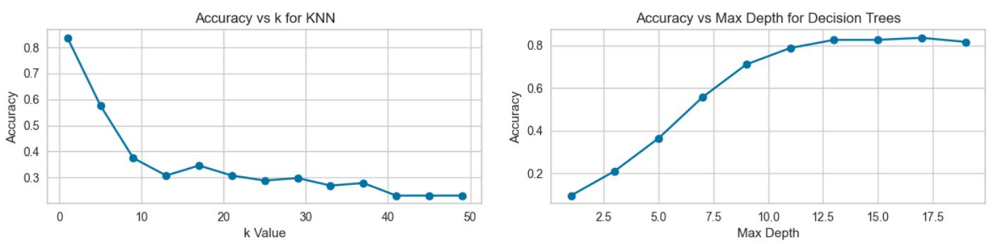

# Meta Learning

"An Empirical Study of MetaLearning for Long Term Groundwater Level Forecasting"

# Getting Started

## 1. Installation
```bash

$ conda create --name metaenv python=3.12.11
$ conda activate metaenv
$ pip install -r requirements.txt

```

## 2. Usage

We have provided the data and notebooks for running the data analysis obtained for this study. Each analysis is separate
across different notebooks.

## 3. Reproducibility

```bash

$ ./example_script.sh

```
User can change the filename for the corresponding execution of each model in the example script.


# Results
We selected white-box machine learning models such as K-nearest neighbors (KNN) and Decision Tree (DT) for building the
meta-learners. Both DT and KNN have good performance on the meta-dataset; however, DT seems to be able to deal well
with the data.



# Citation
If you use this repository for your work, please consider to cite our paper: