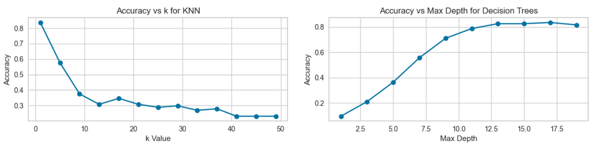

<div align="center">

# An Empirical Study of Meta-Learning for Long-Term Groundwater Level Forecasting

[](https://www.python.org/) [](https://docs.conda.io/) [](LICENSE)

> Official implementation and experimental code for the paper.

</div>

---

## 📌 Overview

This repository contains the complete datasets, experimental codes, empirical analysis, and execution scripts for evaluating our meta-learning approach applied to long-term groundwater level forecasting. The groundwater level data used in this work was selected with the support of experts from BRGM (French Geological Survey). It contains measurements from 12 piezometers located in two regions of France: Région 11 Île-de-France and Région 24 Centre-Val de Loire 1. The piezometers were chosen to represent the diversity of hydrogeological dynamics over several decades, thus supporting long-term forecasting.

---

## 🚀 Getting Started

### 1. Prerequisites & Installation

We recommend using [Conda](https://docs.conda.io/) to manage dependencies in an isolated environment.

```bash
# Clone the repository
git clone [https://github.com/phamdps/metalearning.git](https://github.com/phamdps/metalearning.git)
cd metalearning

# Create and activate the conda environment
conda create --name metaenv python=3.12.11 -y
conda activate metaenv

# Install dependencies
pip install -r requirements.txt

```

---

## 💻 Usage & Experiments

The analysis is organized modularly across distinct Jupyter notebooks in the repository:

* Navigate to the `notebooks/` directory to inspect specific data analysis tasks and model evaluations.
* Preprocessed groundwater datasets are located in the `data/` folder.

---

## 🔄 Reproducibility

To reproduce the full pipeline or run specific model experiments, execute the helper script:

```bash
chmod +x example_script.sh
./example_script.sh

```

> **Note:** To test different models, modify the target script filename inside `example_script.sh`.

---

## 📊 Key Results

We evaluated interpretable, "white-box" machine learning models—specifically **$K$-Nearest Neighbors (KNN)** and **Decision Trees (DT)**—to construct meta-learners for long-term forecasting.

While both models show robust performance across the meta-dataset, **Decision Trees demonstrate superior adaptability** in handling complex feature interactions in groundwater dynamics.



---

## 📑 Citation

If you use this repository or our findings in your research, please consider citing our work:

```bibtex
@article{metalearning4gwl:2026,
  title     = {An Empirical Study of Meta-Learning for Long Term Groundwater Level Forecasting},
  author    = {Author Name(s)},
  journal   = {Journal Name / Conference},
  year      = {2026},
  doi       = {10.xxxx/xxxxxx}
}

```

---

## 🤝 Contributing & License

Distributed under the MIT License. See `LICENSE` for more information.
